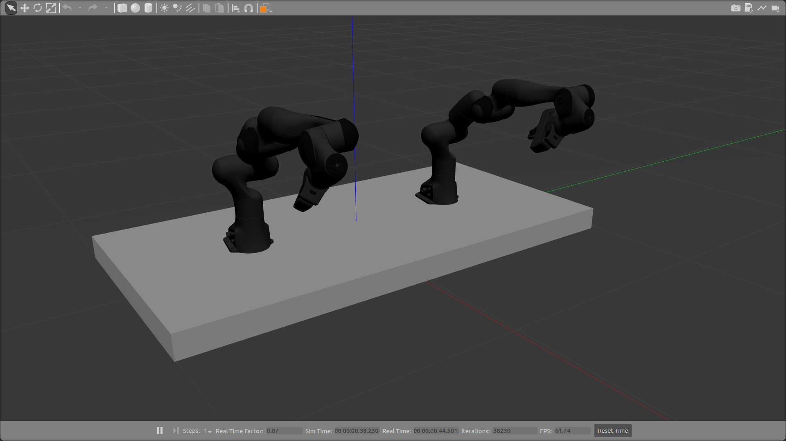

# Franka Emika Dual Arm (Gazebo support)
## Introduction
This package is an abomination between some existing solutions online. It combines franka_gazebo (which is a package which has additional inertia for the franka robots) and some other gazebo tags. Then it uses some example package from the Franka Emika robot company which has a xacro file for 2 arms. [Another package is built for using this with MoveIt!](https://github.com/Machine-Jonte/panda_dual_gazebo_moveit_config). 

  

## Guide
Use the xacro file dual_panda.urdf.xacro when building the MoveIt! configuration.

## Additional information
Do not launch Gazebo using the launch file in this package! Use the launch file from the MoveIt! package. The default PID controller in this package is not valid either.

# Note
The naming convention in this package is sub optimal. Might change in the future so that the name of the xacro files and robot name in the dual_arm.urdf.xacro match with the package name. This naming convention would make it easier to generate IKFast for the package.
